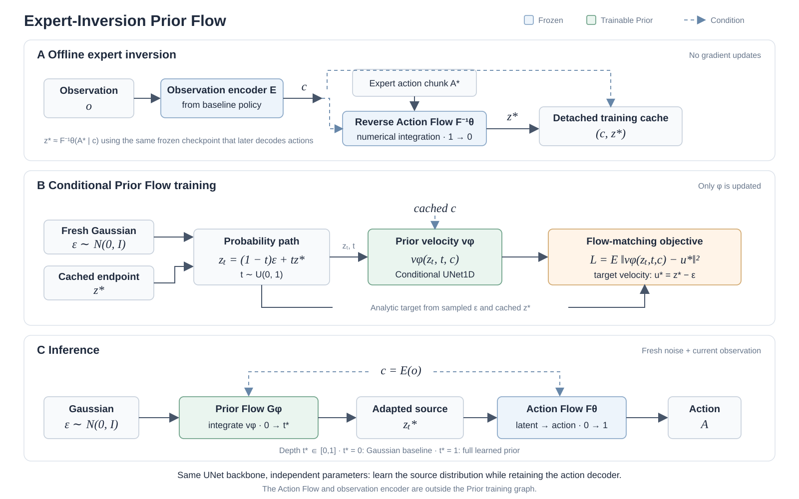

# Frozen Flow Inversion Latent Experiments

本仓库提供冻结 Flow Matching policy 下的 expert inversion latent 实验代码。代码依赖原始 MomentVLA/RoboVerse 工程、checkpoint、数据集和 latent cache；这些大文件不提交到 Git。

## Expert-Inversion Prior Flow

我们在冻结的 Action Flow 前引入条件 Prior Flow，将标准高斯噪声映射到专家动作的反演 latent 分布，以保留基线已有的动作生成能力，并通过学习 source 分布使采样更贴近专家行为。首先，使用基线冻结的观测编码器得到统一条件 $c=E(o)$，在同一条件下通过 Action Flow 的反向数值积分得到 $z^\star\approx F_\theta^{-1}(A^\star\mid c)$，离线缓存 $(c,z^\star)$；随后训练与 Action Flow 采用相同 Conditional UNet1D 主干、但参数独立的速度网络 $v_\phi$：采样 $\epsilon\sim\mathcal N(0,I)$ 和 $t\sim U(0,1)$，构造 $z_t=(1-t)\epsilon+tz^\star$，最小化 $\mathcal L=\mathbb E\lVert v_\phi(z_t,t,c)-(z^\star-\epsilon)\rVert_2^2$。这种设计将条件分布学习与动作解码分开：训练仅使用缓存的条件和 latent、只更新 $\phi$，Action Flow 与观测编码器完全不参与反向传播；推理时从新的高斯噪声出发，对 Prior Flow 从 $t=0$ 积分到 $t=1$ 得到 $z_{\rm prior}=G_\phi(\epsilon,c)$，再由冻结的 $F_\theta(z_{\rm prior}\mid c)$ 生成动作，无需专家动作或反演缓存。Prior Flow 也可仅积分至 $t^*\in[0,1]$，以调节对原始高斯 source 的变换程度；$t^*=0$ 恢复高斯基线，$t^*=1$ 使用完整 Prior Flow。



[核心代码与使用说明](../prior_policy/full_data_prior/) · [架构图 SVG](../assets/prior_flow_architecture.svg)

## 代码文件

| 文件 | 作用 |
|---|---|
| `flow_latent_predictor_common.py` | 公共底层接口：加载冻结 Flow、执行可微 forward sampling、读取 cache、处理 condition 和 action normalization，并检查模型完整性。 |
| `prepare_inverted_latent_dataset.py` | 将 expert action chunk 通过 Flow reverse integration 反演为 `z_star`，生成可断点续跑的 train/validation cache。 |
| `conditional_latent_relevance_test.py` | 在固定 condition 下比较 inversion、单次 Gaussian random 和 Random Oracle Best@100 的 action error。 |
| `native_cycle_vs_expert_distribution_audit.py` | 构造并审计 `z_native`、`z_cycle`、`z_expert`，计算 covariance spectrum、effective rank、whitening 和径向统计。 |
| `local_latent_region_test.py` | 以 `z_star` 为中心进行不同半径的局部 Gaussian sampling，并与全局 N(0,I) sampling 比较。 |
| `directional_latent_geometry_test.py` | 在相同 latent 扰动长度下比较 radial outward、radial inward 和随机 tangential direction。 |
| `latent_geometry_figures.py` | 计算冻结 Flow 的精确 Jacobian、`J_F^T J_F` 的切向谱，以及 radial/high-sensitivity 和 low/high-sensitivity 行为网格。 |
| `behavior_region_localizer.py` | 仅用 train episodes 构建 Behavior Region Bank，进行 50/200-step teacher ranking，训练 behavior-supervised region locator，并在 validation 上比较 retrieval、Gaussian 和 candidate oracle。 |
| `evaluate_behavior_region_policy.py` | 评估 BRL anchor、isotropic local、tangent local 与 tangent + norm projection 的 Stage-2 初始化几何。 |
| `evaluate_behavior_region_rollout.py` | 为现有 RoboVerse rollout wrapper 提供 paired seed/scenario 的 clean 与 OOD 闭环评测 harness。 |
| `evaluate_region_warmstart_speed.py` | 为 NFE sweep、intermediate-state warm-start 和同步 GPU wall-clock 测速提供统一 harness。 |
| `temporal_region_continuity_test.py` | 对同一 episode 的相邻 policy update 比较 current inversion、previous-latent reuse、Gaussian 和 observation retrieval，验证 behavior region 是否可追踪。 |
| `behavior_region_tracker.py` | 下一阶段方法：从上一时刻已执行 action chunk 反演得到 `z_prev`，再根据上一/当前 causal observation 预测局部 residual，并提供 tangent 与 norm-preserving geometry、offline 训练评估和 online 推理接口。 |
| `evaluate_region_staleness.py` | 在 0/1/2/3/5 cm target relocation 下统计 `E_reuse` 与 current inversion error，定位旧 behavior region 何时失效。 |
| `isaac_region_staleness_runner.py` | 原生 IsaacSim smoke callback：复用现有 PickCube rollout 管线，在 shifted observation 下计算 previous-region reuse 与 current inversion 的 200-step action error；当前明确标注为 recorded-demo replay diagnostic。 |
| `isaac_reuse_rollout_runner.py` | deployable closed-loop callback：首个 query 使用 Gaussian source，之后只反演并复用上一段实际执行 action chunk 的 latent；用于比较 Gaussian source 与 previous-region reuse 的真实任务成功率。 |

所有实验均使用冻结 checkpoint 和 200 步 forward/reverse Flow integration；Flow 参数不参与更新。

## 当前实验结论

我们研究了从 expert action 反演得到的 latent 是否包含与行为相关的结构。实验结果支持以下结论。

**1. Expert inversion latent 与具体行为高度相关。** 在 1915 个 validation conditions 上，inversion 的 executed action error 为 **0.0101**，单次 Gaussian random 为 **0.2629**。即使允许 Gaussian random 采样 100 次并事后根据真实 expert action 选择最优样本，Random Oracle Best@100 仍为 **0.0914**。因此 inversion 分别比 random 和 Oracle Best@100 低约 **26×** 和 **9×**，说明 `z_star` 不是任意先验样本，而是包含当前行为信息的条件 latent。

**2. Expert inversion latent 存在明显的二阶结构重分配。** 以 native latent covariance 为参照，expert/native eigenvalue ratio 在 leading modes 中显著大于 1，在 trailing modes 中显著小于 1，表明 expert variance 被集中到更少的 dominant directions。对应的谱熵 effective rank 从 native 的 **142.7** 降至 cycle 的 **137.9**，再降至 expert 的 **94.2**。

**3. 这种结构不只是 covariance 差异。** 使用 expert training covariance whitening 后，expert 的 `||z_w||^2` 标准差为 **37.86**，而 Gaussian 理论 `chi^2_144` 的标准差为 **16.97**；QQ 曲线在中心和 upper tail 均偏离 `y=x`。因此消除二阶 covariance 后，expert inversion latent 仍保留 higher-order non-Gaussian structure。

**4. Behavior-specific latent region 具有有限半径。** 以 `z_star` 为中心的局部 sampling 在 RMS 半径 sigma = 0.05、0.1、0.25、0.5 下的平均 action error 分别约为 **0.0132、0.0196、0.0472、0.1389**，均低于 global Gaussian 的 **0.2629**；当 sigma = 1.0 时 error 上升至约 **0.8944**。这支持“存在 behavior-specific latent region”，而不是只有一个孤立的特殊 latent point。

**5. 局部区域具有 radial asymmetry 和 directional anisotropy。** 在相同 latent 扰动长度下，RMS 半径 0.75 时，radial outward、radial inward 和 tangential perturbation 的平均 action error 约为 **2.178、0.189、0.378**。此外，冻结 Flow 在 `z_star` 处的 `J_F^T J_F` 显示不同切向方向具有显著不同的 behavioral sensitivity。因此局部 behavior region 既不是以 `z_star` 为中心的圆，也不是各向同性 Gaussian ball，而是一个具有方向性和径向不对称的区域。


总体而言，实验形成了如下证据链：

```text
variance concentration
        →
higher-order non-Gaussian structure
        →
behavior-specific local geometry
```

这为后续的 `track executed behavior → locally correct → decode` 方法提供了直接实验依据。

## 下一阶段：Temporal Behavior Region Tracking

仅根据当前 observation 从 train bank 重新检索绝对 region 的 BRL pilot 没有通过 fail-fast：在小规模 validation 上 learned Top-1 没有稳定优于 observation nearest-neighbour。因此方法改为追踪上一时刻已经执行的行为：

```text
previous executed action chunk + previous condition
        → frozen Flow reverse
        → z_prev
        → (z_prev, previous causal context, current causal context)
        → local residual / geometry constraint
        → frozen Flow forward
        → current action chunk
```

`behavior_region_tracker.py` 的默认行为是安全的 previous-region reuse。只有显式启用 `--enable-correction` 后，才训练 residual 和 staleness gate：

```text
z_prev = F^{-1}(A_{t-1}^{exec} | c_{t-1})
g = gate(z_prev, c_{t-1}, c_t)
z_hat = z_prev                         if g is small
z_hat = Geometry(z_prev + g Δz)         otherwise
```

gate 的 train label 来自 train episodes 中的 action-space reuse error，而不是 latent Euclidean distance。这样正常 temporal transition 默认保持 `g≈0`；只有当旧 region 在当前 condition 下产生明显行为误差时才允许 correction。`tangent_norm` 将 gated update 投影到 `z_prev` 的切空间、限制 RMS 步长，并投影回 anchor norm，以避免 radial outward 的破坏性移动。

相邻正常时刻的离线诊断由 `temporal_region_continuity_test.py` 提供。如果 previous-latent reuse 明显低于 Gaussian，说明 region 可以沿时间追踪；如果闭环扰动后 reuse error 上升，则应触发重新反演或重新定位。该诊断不把 validation latent 放入 train bank，也不使用 future observation。

```bash
python behavior_region_tracker.py \
  --repo /path/to/MomentVLA-main \
  --checkpoint /path/to/30.ckpt \
  --cache /path/to/inversion_cache \
  --output-dir /path/to/behavior_region_localization/stage1_tracking
```

先运行默认 reuse 版本验证 staleness；只有在 0/1/2/3/5 cm relocation 实验确认旧 region 会失效后，再增加 `--enable-correction --geometry tangent_norm`。

闭环 staleness runner 需要返回每个 policy update 的 `e_reuse` 和 `e_current`：

```bash
python evaluate_region_staleness.py \
  --runner your_rollout_module:run \
  --output-dir /path/to/behavior_region_localization/stage3_staleness \
  --shifts-cm 0,1,2,3,5 \
  --seeds 0,1,2
```

正式 validation 固定 forward/reverse 200 steps。在线 wrapper 使用 `load_tracker` 和 `track_from_executed_chunk`：传入上一段完整 action chunk、上一时刻 condition、上一/当前 causal encoded context，得到 `z_prev` 与当前 Flow 初始化 `z_init`。动作与 observation 的真实执行接口由 RoboVerse rollout wrapper 提供。

## 当前部署式核心方法：Invert once, reuse temporally

当前原生 IsaacSim 闭环实现验证一个最小、可部署的时间追踪方法：

```text
A_{t-1}^{exec}
        → F^{-1}(A_{t-1}^{exec} | c_{t-1})
        → z_{t-1}
        → F(z_{t-1} | c_t)
        → A_t
```

实现位于 `isaac_reuse_rollout_runner.py`。第一次 policy query 使用 `N(0,I)`；随后在每个 action chunk 结束时，代码收集已经发送给仿真器的真实执行 action，将其写回对应的完整 Flow chunk，再通过 frozen Flow reverse 得到下一次 query 的 source latent。这样 reuse 的输入来自执行结果，不使用 expert action、validation latent、oracle candidate 或 future observation。

`run_isaac_reuse_single.py` 为每个方法和 shift 启动独立 IsaacSim 进程，并将每个 episode 的 success、grasp/lift 状态、episode length、policy query 数量和平均 Flow 推理时间写入 JSON。正式 rollout 固定 `nfe=200`；runner 会拒绝其他 NFE 设置。

示例配置：

```json
{
  "repo": "/path/to/MomentVLA-main",
  "checkpoint": "/path/to/30.ckpt",
  "device": "cuda:0",
  "task": "pick_cube",
  "robot": "franka",
  "history": 12,
  "max_steps": 120,
  "episodes": 50,
  "method": "previous_region_reuse",
  "scenario": "shift_2cm",
  "nfe": 200
}
```

运行单个条件：

```bash
PYTHONPATH=/path/to/Inversion_policy:/path/to/MomentVLA-main \
python run_isaac_reuse_single.py \
  --config-json reuse_config.json \
  --output-json previous_region_reuse_shift_2cm.json
```

将 `method` 改为 `gaussian` 可得到对照组。两种方法应使用相同 checkpoint、初始状态、shift、episode 数和 NFE；最终比较 success rate，并按 episode 做配对分析。

## 旧版 BRL 实验

`behavior_region_localizer.py` 的 bank 只包含 train-episode inversion latent。Locator 使用 observation feature 学习行为兼容区域的 soft teacher distribution；validation expert action 只用于离线计算 action error，不能进入 bank 或推理输入。默认先用 50-step Flow 生成训练标签，并用至少 5000 个 candidate pairs 与 200-step teacher 比较；Spearman 低于 0.90 时自动回退到 100 或 200 steps。

生成可用于 warm-start 的 cache 时，增加 `--save-intermediate-states`；该选项同时保存当前 proprio 和 `x_tau_025/050/075`。

```bash
python behavior_region_localizer.py \
  --repo /path/to/MomentVLA-main \
  --checkpoint /path/to/30.ckpt \
  --cache /path/to/inversion_cache \
  --output-dir /path/to/behavior_region_localization/stage1_locator

python evaluate_behavior_region_policy.py \
  --repo /path/to/MomentVLA-main \
  --checkpoint /path/to/30.ckpt \
  --cache /path/to/inversion_cache \
  --stage1-dir /path/to/behavior_region_localization/stage1_locator \
  --output-dir /path/to/behavior_region_localization/stage2_geometry
```

正式 Flow validation 固定 200 steps；rollout 和测速脚本需要通过 `--runner module:function` 接入现有环境 wrapper，因此本仓库不会虚构 simulator API。

## 基本运行方式

先生成 inversion cache：

```bash
python prepare_inverted_latent_dataset.py \
  --repo /path/to/MomentVLA-main \
  --checkpoint /path/to/30.ckpt \
  --zarr /path/to/dataset.zarr \
  --cache /path/to/inversion_cache
```

其余脚本使用相同的 `--repo`、`--checkpoint` 和 `--cache` 参数。依赖见 `requirements.txt`；数据集、checkpoint、cache 和生成结果应保存在仓库之外。
